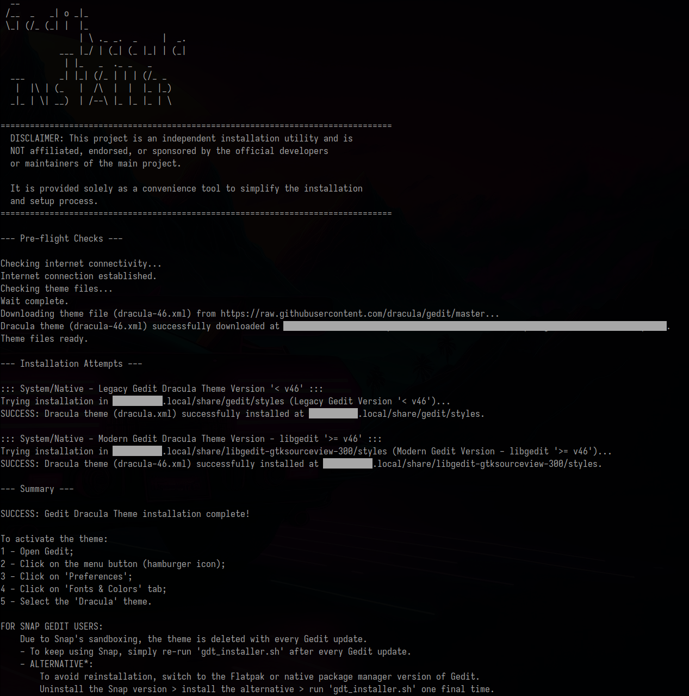
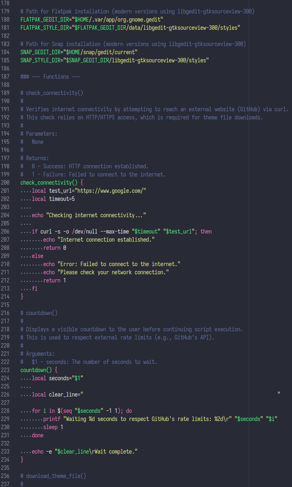

# 🧛 Gedit Dracula Theme Installer (gdt_installer)

**v0.1.0 (beta)** [](https://github.com/mozertdev/gedit-dracula-installer/stargazers)

A robust Shell script for **quick and automatic installation** of the Dracula theme in Gedit.
This utility automates the download and installation process of the beautiful Dracula theme across all known Gedit versions and installation methods on Linux: **native** (Legacy and Modern), **Flatpak**, and **Snap** installs.




---

## ⚠️ Development Status

This script is currently in **v0.1.0 (beta)** stage.

While the core functionality (downloading and installing themes for Native, Flatpak, and Snap) has been thoroughly tested and is considered robust, minor edge cases or compatibility issues with future Gedit releases may occur.

**Feedback is highly encouraged** to ensure the script's stability and compatibility across all major Linux distributions and Gedit versions. Please report any issues via the GitHub [Issues tab](https://github.com/mozertdev/gedit-dracula-installer/issues).

---

## ⚠️ Important Disclaimer

This project is an independent installation utility and is **NOT** affiliated with, endorsed by, or sponsored by the official Dracula theme developers or maintainers. It is provided solely as a convenience tool to simplify the setup process.

**Acknowledgments:** The Gedit Dracula theme is an amazing project created and maintained by **Ricardo Madriz**, **Zeno Rocha** and the dedicated contributors of the Dracula community.

* **Official Theme Repository:** [https://github.com/dracula/gedit](https://github.com/dracula/gedit)
* **Official Theme Website:** [https://draculatheme.com/gedit](https://draculatheme.com/gedit)

---

## ✨ Features

* **Multi-Faceted Installation:** Supports Gedit installations across four main configuration paths:
  * **Legacy Native** (`< v46`): `$HOME/.local/share/gedit/styles/`
  * **Modern Native** (`>= v46`): `$HOME/.local/share/libgedit-gtksourceview-300/styles/`
  * **Flatpak** (`>= v46`): `$HOME/.var/app/org.gnome.gedit/data/libgedit-gtksourceview-300/styles/`
  * **Snap** (`>= v46`): `$HOME/snap/gedit/current/libgedit-gtksourceview-300/styles/`
* **Pre-flight Checks:** Verifies the availability of essential commands (`curl`,  etc.) before execution.
* **Connectivity Check:** Ensures internet access before attempting to download the theme files.
* **Rate Limit Handling:** Includes a 10-second pause between the download of the two theme files (`dracula.xml` and `dracula-46.xml`) to respect GitHub's rate limits.

---

## ⚙️ Dependencies

This script relies on several standard command-line utilities for execution. All dependencies are checked automatically upon script launch, and an error message with installation instructions will be displayed if any are missing.

### :: Important Pre-requisite ::

For the script to work correctly, **Gedit must be installed and must have been executed at least once** on your system (Native, Flatpak or Snap installation). Running Gedit ensures that all necessary configuration directories are created in the user's home folder, allowing the script to find and install the theme correctly.

### Required Utilities

| Utility         | Purpose                                                                                                                                                                                                                                                      |
|:--------------- |:------------------------------------------------------------------------------------------------------------------------------------------------------------------------------------------------------------------------------------------------------------ |
| **`curl`**      | Mandatory for network connectivity checks and downloading theme files.                                                                                                                                                                                       |
| **`coreutils`** | Contains essential basic commands such as (`cp`, `mkdir`, `rm`, `cat`, `seq`, `dirname`, `readlink`, `printf`, `sleep`). These are generally pre-installed on every Linux distribution, but are included in the verification process for maximum robustness. |

### Installing Missing Dependencies (Required: curl & coreutils)

If the script detects missing dependencies, you will need to install the **`curl`** package and ensure the **`coreutils`** package is fully installed (or not damaged).

Use one of the following commands based on your Linux distribution to ensure both packages are available:

| Distribution                 | Package Manager | Command to Install `curl` and `coreutils`                   |
|:---------------------------- |:--------------- |:----------------------------------------------------------- |
| **Debian/Ubuntu/Mint/Zorin** | `apt`           | `sudo apt update && sudo apt install curl coreutils -y`     |
| **Fedora/CentOS/RHEL**       | `dnf`           | `sudo dnf install curl coreutils -y`                        |
| **Arch/Manjaro**             | `pacman`        | `sudo pacman -Syu curl coreutils`                           |
| **openSUSE**                 | `zypper`        | `sudo zypper refresh && sudo zypper install curl coreutils` |

---

## 🚀 Quick Installation

### One-Liner Installation (Recommended)

To install the Dracula theme automatically, simply run the following command in your terminal. This command downloads the script and executes it directly using `bash`.

```bash
curl -fsSL https://raw.githubusercontent.com/mozertdev/gedit-dracula-installer/main/gdt_installer.sh | bash
```

### Manually installation

Follow these simple steps to run the installer.

1. **Clone the Repository** (or download the `gdt_installer.sh` file).
   
   ```bash
   git clone https://github.com/mozertdev/gedit-dracula-installer && cd gedit-dracula-installer
   ```

2. **Grant Execution Permission**
   To make the script executable:
   
   ```bash
   chmod +x gdt_installer.sh
   ```

3. **Run the Script**
   The script will take care of the rest automatically:
   
   ```bash
   ./gdt_installer.sh
   ```

The script will confirm checks, download the theme files, and attempt to install them in all known Gedit configuration paths.

---

## 🎨 Activation in Gedit

After successful execution, you must **activate the theme** within Gedit:

*PS: If Gedit is already open, close it and open it again.*

1. Open **Gedit**.
2. Click on the menu (hamburger) button and select **"Preferences"**.
3. Go to the **"Fonts & Colors"** tab.
4. Select **"Dracula"** from the color schemes list.

---

## 💡Troubleshooting Additional Tips

If the script fails to install the theme (e.g., if you are using a **Snap** installation or a non-standard directory path), you can attempt manual installation or use these tips:

| Installation Scenario             | Theme File       | Typical Target Directory                                                 |
|:--------------------------------- |:---------------- |:------------------------------------------------------------------------ |
| **Gedit Legacy** (Repo, `< v46`)  | `dracula.xml`    | `$HOME/.local/share/gedit/styles/`                                       |
| **Gedit Modern** (Repo, `>= v46`) | `dracula-46.xml` | `$HOME/.local/share/libgedit-gtksourceview-300/styles/`                  |
| **Gedit Flatpak** (`>= v46`)      | `dracula-46.xml` | `$HOME/.var/app/org.gnome.gedit/data/libgedit-gtksourceview-300/styles/` |
| **Gedit Snap** (`>= v46`)         | `dracula-46.xml` | `$HOME/snap/gedit/current/libgedit-gtksourceview-300/styles/`            |

### Snap Installation Note (Important)

Although this installer supports the Snap installation path, the nature of Snap's periodic updates means **the Dracula theme may be overwritten and require reinstallation after a Gedit Snap update.** 

* **Action:** Simply **rerun `gdt_installer.sh`** after any Gedit update via Snap. 

* **Alternative:** To avoid this inconvenience, consider using the Flatpak or native package manager edition of Gedit instead.

---

## 🚨 Script Maintenance and Script Stability Warning

This installer relies on the consistent structure and naming conventions used by the official Dracula Theme repository for Gedit, including the file names (`dracula.xml`, `dracula-46.xml`) and the download source URLs.

**Instability Risk:** Any upstream changes to the official repository—such as file name modifications, URL changes, or the introduction of new Gedit version paths—may cause this installer script to fail.

**Reporting Issues:** If the script fails to execute successfully or if Gedit introduces a new version (e.g., v48) that requires a different installation path, please report the issue immediately via the repository's [Issues tab](https://github.com/mozertdev/gedit-dracula-installer/issues).

Your feedback is crucial for maintaining the script's compatibility with the latest Gedit releases.

---

## 🙏 Special Thanks

I am grateful to my Lord and Savior, Jesus Christ, for the opportunity to work on this project and help the community.

---

### ⭐️ Support the Project

If the `gdt_installer` simplified your Gedit Dracula theme setup, please consider supporting this project by **leaving a star (⭐️) on GitHub!**

Your support is essential for the continuous maintenance and visibility of this project.

[](https://github.com/mozertdev/gedit-dracula-installer/stargazers)

---

## 📄 License

This project is distributed under the **MIT License**. See the script header or [LICENSE](./LICENSE) for full license details.

*Copyright (c) 2025 gedit-dracula-installer (gdt_installer) [mozertdev]*
